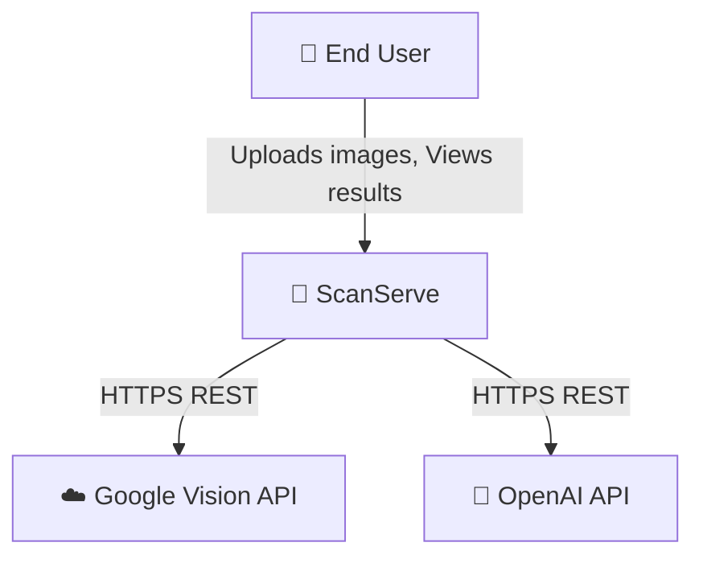

# ScanServe — Architecture Documentation

> Portfolio-ready architecture documentation for the Intelligent Receipt OCR Platform

---

## Executive Summary

**ScanServe** is a full-stack monorepo application that transforms receipt photos into structured, searchable data. It combines dual OCR engines (EasyOCR + Google Cloud Vision) with a 3-stage multi-agent AI pipeline that normalizes, validates, and formats receipt data — all streamed to the UI in real-time via NDJSON.

### Key Architectural Highlights

- **Monorepo Structure**: Clean separation between `frontend/` (React SPA) and `backend/` (FastAPI API)
- **Feature-Sliced Architecture**: Self-contained `features/receipts/` module with its own data layer, hooks, and components
- **Multi-Agent AI Pipeline**: Organizer → Auditor → Stylist orchestration with streaming observability
- **Offline-First Storage**: IndexedDB for client-side persistence with zero cloud dependency
- **Type-Safe Contracts**: Pydantic v2 models map 1:1 to TypeScript interfaces

---

## Architecture Diagrams

### 1. System Context (C4 Level 1)

**File**: [`context.mmd`](./context.mmd)

**What it represents**: The system boundary showing ScanServe as the central system, the end user as the primary actor, and the two external cloud services it depends on.

**Technical Decisions**:
- **Dual OCR Strategy**: Google Vision for accuracy, EasyOCR as fallback (no API key required)
- **OpenAI for AI Pipeline**: Leverages GPT models for intelligent receipt parsing with Icelandic language support

**Trade-offs**:
- External API dependencies introduce latency and cost
- EasyOCR provides offline capability but lower accuracy than Vision API

---

### 2. Container Diagram (C4 Level 2)

**File**: [`containers.mmd`](./containers.mmd)

**What it represents**: The high-level technology containers that make up ScanServe:

| Container | Technology | Purpose |
|-----------|------------|---------|
| **SPA** | React 18, TypeScript, Vite | User interface with real-time AI streaming |
| **API** | FastAPI, Python 3.12 | OCR processing, AI orchestration, file management |
| **IndexedDB** | Browser native | Offline-first receipt storage |
| **File Storage** | Local filesystem | Uploaded images, JSON database, AI trace logs |

**Technical Decisions**:
- **Vite over CRA/Next.js**: Faster HMR, simpler config, SWC compilation
- **FastAPI over Flask/Django**: Native async, automatic OpenAPI docs, Pydantic integration
- **IndexedDB over localStorage**: Supports large binary blobs (images), structured queries

**Trade-offs**:
- File-based JSON database limits scalability (acceptable for single-user/demo)
- IndexedDB API is verbose (mitigated by repository pattern abstraction)

---

### 3. Backend Components (C4 Level 3)

**File**: [`components.mmd`](./components.mmd)

**What it represents**: Internal structure of the FastAPI backend showing:

- **API Layer**: Route handlers organized by domain (OCR, Receipts, Folders, Notifications)
- **Services Layer**: Business logic with clear separation (OCR engines, AI pipeline, storage)
- **Data Layer**: File-based persistence (JSON DB, uploads, logs)

**Technical Decisions**:
- **Dependency Injection**: FastAPI's `Depends()` for service instantiation
- **AI Pipeline as Generator**: `parse_stream()` yields NDJSON events for real-time UI updates
- **Thread-based OCR Queue**: Handles concurrent batch processing without blocking the event loop

**Trade-offs**:
- Thread pool (not async) for OCR due to EasyOCR's synchronous nature
- Single JSON file for DB simplifies deployment but limits concurrent writes

---

### 4. AI Pipeline Sequence Diagram

**File**: [`sequence-ai-pipeline.mmd`](./sequence-ai-pipeline.mmd)

**What it represents**: The most differentiating flow in ScanServe — the 3-stage AI receipt parsing pipeline with real-time streaming:

1. **Organizer Agent**: Normalizes raw OCR text with Icelandic context
2. **Auditor Agent**: Cross-validates extracted fields (merchant, date, total)
3. **Stylist Agent**: Generates clean Markdown output

**Technical Decisions**:
- **NDJSON Streaming**: Each stage emits `stage_start`, `stage_result`, `notes`, `stage_end` events
- **AI Trace Service**: Every run persists revision history with Markdown snapshots for debugging
- **JSON Retry Logic**: Automatic retry with simplified prompt if LLM returns invalid JSON

**Trade-offs**:
- Sequential agent execution (not parallel) ensures data flows correctly between stages
- Streaming adds complexity but dramatically improves perceived performance

---

### 5. Deployment Diagram

**File**: [`deployment.mmd`](./deployment.mmd)

**What it represents**: Infrastructure nodes for production and development environments.

| Environment | Frontend | Backend |
|-------------|----------|---------|
| **Production** | Netlify/Vercel (CDN) | Render (PaaS) |
| **Development** | Vite dev server (:8080) | Uvicorn with reload (:8000) |

**Technical Decisions**:
- **Render Detection**: Backend auto-detects Render via `RENDER` env var, binds to `0.0.0.0:PORT`
- **Ephemeral Storage**: Render's filesystem is ephemeral; acceptable for demo (no persistent user data)
- **CORS Configuration**: `RV_CORS_ORIGINS` env var for flexible origin allowlist

**Trade-offs**:
- Ephemeral storage means uploaded images are lost on redeploy (production would need S3/GCS)
- Single instance limits horizontal scaling (acceptable for portfolio demo)

---

## Tech Stack Summary

### Frontend

| Category | Technology |
|----------|------------|
| Framework | React 18 + TypeScript 5.8 |
| Build | Vite 5 (SWC) |
| Styling | Tailwind CSS 3 + shadcn/ui + Radix UI |
| State | Zustand 5 (global) + TanStack Query v5 (server) |
| Routing | React Router v6 |
| Forms | React Hook Form + Zod |
| Storage | IndexedDB (raw API) |
| HTTP | Axios (REST) + native fetch (NDJSON) |

### Backend

| Category | Technology |
|----------|------------|
| Framework | FastAPI 0.115 + Uvicorn |
| Runtime | Python 3.12 |
| Validation | Pydantic v2 + pydantic-settings |
| OCR | EasyOCR 1.7 + Google Cloud Vision API |
| AI/LLM | OpenAI API (gpt-5-mini / gpt-5-nano) |
| Storage | File-based JSON + static files |
| Concurrency | Thread-based OCR queue |

---

## Design Patterns

| Pattern | Implementation |
|---------|----------------|
| **Feature-Sliced Architecture** | `features/receipts/` is self-contained with db, hooks, components, types |
| **Repository Pattern** | `receiptsRepository.ts`, `foldersRepository.ts` abstract IndexedDB |
| **Dependency Injection** | FastAPI `Depends()` for services |
| **Pipeline Pattern** | `ReceiptAiPipeline` orchestrates 3 sequential agents |
| **Observer/Stream** | NDJSON streaming for real-time UI updates |
| **Strategy Pattern** | Dual OCR engines selectable at runtime |

---

## Assumptions & Uncertainties

### Confirmed from Code

- ✅ Render deployment detected via `RENDER` env var in `backend/main.py`
- ✅ NDJSON streaming protocol documented in README and implemented in `api.ts`
- ✅ IndexedDB schema with receipts, folders, settings stores
- ✅ AI trace service persists Markdown snapshots to `logs/` directory

### Assumptions (Not Verified in Code)

- ⚠️ **Frontend Hosting**: Assumed Netlify/Vercel based on Vite SPA pattern (no deployment config found)
- ⚠️ **Email Notifications**: Endpoint exists but actual email sending implementation not found (may be placeholder)
- ⚠️ **Production Database**: File-based JSON assumed for demo; production would likely need PostgreSQL/Supabase
- ⚠️ **Authentication**: No auth layer found; assumed single-user/demo mode

### Uncertainties

- ❓ **CI/CD Pipeline**: No GitHub Actions or similar config found
- ❓ **Monitoring/APM**: No observability tooling beyond custom logging
- ❓ **Rate Limiting**: No rate limiting middleware for API protection

---

## File Index

| File | Description |
|------|-------------|
| [`architecture.json`](./architecture.json) | Structured system metadata (actors, containers, components, flows) |
| [`context.mmd`](./context.mmd) | C4 Context diagram (Mermaid) |
| [`containers.mmd`](./containers.mmd) | C4 Container diagram (Mermaid) |
| [`components.mmd`](./components.mmd) | C4 Component diagram - Backend (Mermaid) |
| [`sequence-ai-pipeline.mmd`](./sequence-ai-pipeline.mmd) | AI Pipeline sequence diagram (Mermaid) |
| [`deployment.mmd`](./deployment.mmd) | Deployment infrastructure diagram (Mermaid) |

---

## Rendering Diagrams

All `.mmd` files are Mermaid diagrams. To render:

1. **VS Code**: Install "Mermaid Preview" extension
2. **GitHub**: Mermaid is natively supported in `.md` files
3. **Online**: Paste into [mermaid.live](https://mermaid.live)
4. **CLI**: Use `mmdc` (Mermaid CLI) to export PNG/SVG

---

*Generated for portfolio documentation — March 2026*
